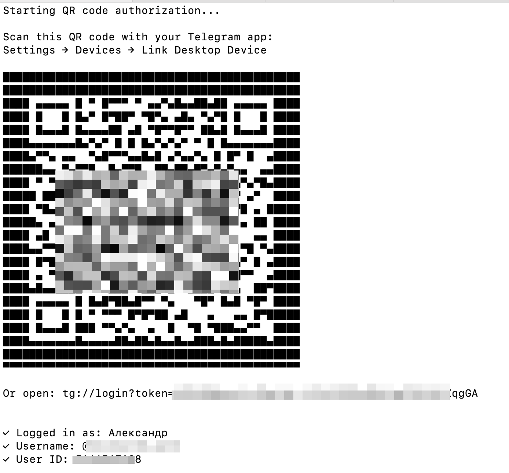

# Инструкция: Автоматическая отправка сообщений в Telegram через n8n

## Введение

Эта инструкция поможет вам настроить автоматическую отправку сообщений в Telegram от вашего личного аккаунта через n8n (платформу автоматизации).

**Что вам понадобится:**
- Сервер с установленным Docker
- Аккаунт Telegram
- Базовые навыки работы с терминалом Linux

**Время выполнения:** 30-40 минут

---

## Шаг 1: Получение API credentials от Telegram

### 1.1 Создание приложения

1. Откройте браузер и перейдите на https://my.telegram.org
2. Войдите, используя свой номер телефона Telegram
3. Введите код подтверждения, который придет в Telegram
4. Нажмите **"API development tools"**
5. Заполните форму создания приложения:
   - **App title:** любое название (например, "n8n automation")
   - **Short name:** короткое имя (например, "n8nSend")
   - **URL:** адрес вашего сайта или n8n (необязательно)
   - **Platform:** оставьте по умолчанию

6. Нажмите **"Create application"**

### 1.2 Сохранение данных

После создания вы увидите:
- **App api_id** — число (например, `12345678`)
- **App api_hash** — длинная строка (например, `a1b2c3d4e5f6g7h8...`)

**ВАЖНО:** Сохраните эти данные в надежном месте! Они понадобятся позже.

---

## Шаг 2: Подготовка структуры файлов

### 2.1 Создание папки для скриптов

Подключитесь к серверу по SSH и выполните команды:

```bash
cd ~
mkdir telegram_app
cd telegram_app
```

---

## Шаг 3: Создание скриптов

### 3.1 Скрипт авторизации (auth_qr.py)

Создайте файл:

```bash
nano ~/telegram_app/auth_qr.py
```

Вставьте код (замените `api_id` и `api_hash` на свои!):

```python
from telethon.sync import TelegramClient
import qrcode

# ЗАМЕНИТЕ НА СВОИ ДАННЫЕ!
api_id = 12345678  # Ваш api_id
api_hash = 'your_api_hash_here'  # Ваш api_hash

print("Starting QR code authorization...")

client = TelegramClient('telegram_session', api_id, api_hash)

async def main():
    await client.connect()
    
    qr_login = await client.qr_login()
    
    # Показываем QR-код
    qr = qrcode.QRCode()
    qr.add_data(qr_login.url)
    qr.make()
    print("\nScan this QR code with your Telegram app:")
    print("Settings → Devices → Link Desktop Device\n")
    qr.print_ascii(invert=True)
    print(f"\nOr open: {qr_login.url}\n")
    
    # Ждем авторизации
    await qr_login.wait()
    
    me = await client.get_me()
    print(f"\n✓ Logged in as: {me.first_name}")
    if me.username:
        print(f"✓ Username: @{me.username}")
    print(f"✓ User ID: {me.id}")
    
    await client.disconnect()
    print("\n✓ Session saved to telegram_session.session")

import asyncio
asyncio.run(main())
```

Сохраните файл: **Ctrl+O**, **Enter**, **Ctrl+X**

### 3.2 Скрипт отправки сообщений (send_telegram.py)

Создайте файл:

```bash
nano ~/telegram_app/send_telegram.py
```

Вставьте код (используйте те же `api_id` и `api_hash`!):

```python
#!/usr/bin/env python3
from telethon.sync import TelegramClient
import sys

# ЗАМЕНИТЕ НА СВОИ ДАННЫЕ!
api_id = 12345678  # Ваш api_id
api_hash = 'your_api_hash_here'  # Ваш api_hash

session_file = '/telegram_app/telegram_session'

if len(sys.argv) < 3:
    print("Usage: python3 send_telegram.py <recipient> <message>")
    sys.exit(1)

recipient = sys.argv[1]
message = sys.argv[2]

try:
    client = TelegramClient(session_file, api_id, api_hash)
    client.connect()
    
    if not client.is_user_authorized():
        print("Not authorized! Run authorization first.")
        sys.exit(1)
    
    client.send_message(recipient, message)
    print(f"✓ Message sent to {recipient}")
    
except Exception as e:
    print(f"✗ Error: {e}")
    sys.exit(1)
finally:
    client.disconnect()
```

Сохраните файл: **Ctrl+O**, **Enter**, **Ctrl+X**

---

## Шаг 4: Создание Dockerfile и образа

```bash
nano ~/telegram_app/Dockerfile
```

Вставьте код:

```dockerfile
FROM n8nio/n8n:latest

USER root

RUN apk add --no-cache python3 py3-pip && \
    pip3 install --break-system-packages telethon qrcode

RUN mkdir -p /telegram_app && \
    chown node:node /telegram_app

USER node
```

###  Проверка структуры файлов

```bash
ls -la ~/telegram_app/
```

Должны быть файлы:
- `Dockerfile`
- `auth_qr.py`
- `send_telegram.py`

---

### Сборка Docker образа


```bash
cd ~/telegram_app
sudo docker build -t n8n-telegram:latest .
```

После завершения процесса, если набрать

```bash
sudo docker images | grep n8n-telegram
```

то должна появиться строка с вашим образом.

---

## Шаг 5: Запуск контейнера

### 5.1 Остановка старого контейнера (если есть)

Если у вас уже запущен n8n:

```bash
sudo docker stop n8n
sudo docker rm n8n
```

### 5.2 Запуск нового контейнера из своего образа

**ВАЖНО:** Замените `domain.ru` на ваш реальный домен!

```bash
sudo docker run -d \
 --name n8n \
 --restart unless-stopped \
 -p 5678:5678 \
 -e N8N_HOST=domain.ru \
 -e N8N_PORT=5678 \
 -e N8N_PROTOCOL=https \
 -e N8N_EDITOR_BASE_URL="https://domain.ru/" \
 -e WEBHOOK_URL=https://domain.ru/ \
 -v ~/.n8n:/home/node/.n8n \
 -v ~/telegram_app:/telegram_app \
 --user "1000:1000" \
 -it \
 n8n-telegram:latest
```

**Обратите внимание:** В конце указан `n8n-telegram:latest` — это ваш собственный образ с Python!

### 5.3 Проверка запуска

```bash
sudo docker ps | grep n8n
```

Должна появиться строка с контейнером в статусе "Up".


---

## Шаг 6: Авторизация в Telegram

### 6.1 Запуск скрипта авторизации

```bash
sudo docker exec -it n8n /bin/sh
cd /telegram_app
python3 auth_qr.py
```

### 6.2 Сканирование QR-кода

В терминале появится QR-код (ASCII-арт).

**На вашем телефоне:**
1. Откройте Telegram
2. Перейдите в **Settings** (Настройки)
3. Выберите **Devices** (Устройства)
4. Нажмите **Link Desktop Device** (Подключить устройство)
5. Отсканируйте QR-код из терминала

### 6.3 Подтверждение авторизации

После сканирования в терминале появится:
```
✓ Logged in as: Ваше Имя
✓ Username: @your_username
✓ Session saved to telegram_session.session
```



**Поздравляем! Авторизация прошла успешно.**

### 6.4 Выход из контейнера

```bash
exit
```

---

### 6.5: Тестирование отправки сообщений

Отправим сообщение себе, чтобы убедиться, что наши скрипты работают

```bash
sudo docker exec n8n python3 /telegram_app/send_telegram.py "me" "Тест!"
```

Проверьте **Saved Messages** (Избранное) в Telegram — там должно появиться сообщение.


---

## Шаг 7: Настройка workflow в n8n

Создайте workflow в вашем n8n и добавье туда ноду вебхук

Затем добавьте ноду Execute Command. В поле **Command** введите полную команду (в одну строку):

```
python3 /telegram_app/send_telegram.py "{{ $json.recipient }}" "{{ $json.message }}"
```

**Обратите внимание:**
- Кавычки вокруг `{{ $json.recipient }}` обязательны
- Кавычки вокруг `{{ $json.message }}` обязательны
- Пробелы важны


Соедините ноды Webhook с Execute Command, активируйте воркфлоу.

Всё, теперь воркфлоу готов к работе!


---

## Важные ограничения и рекомендации

### Лимиты Telegram

⚠️ **Telegram накладывает ограничения на автоматические сообщения:**
- Максимум ~30-40 новых диалогов в день
- Максимум ~200-300 сообщений в час
- При превышении лимитов аккаунт может быть временно ограничен

**Рекомендации:**
- Добавляйте задержки между сообщениями (минимум 1-2 секунды)
- Не отправляйте массовые рассылки незнакомым людям
- Используйте автоматизацию аккуратно

### Безопасность

🔒 **Файл сессии = полный доступ к аккаунту:**
- `telegram_session.session` содержит ключи авторизации
- НЕ делитесь этим файлом с другими людьми
- НЕ загружайте его в публичные репозитории (GitHub и т.д.)
- НЕ включайте файл сессии в Docker образ при публикации
